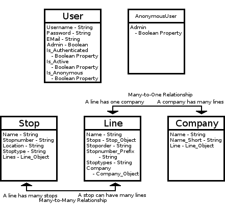

# Design

## Technical Components
Admin section to change/add parts of the Transport Network to the database;
* Using FlaskLogin and FlaskAdmin this can be achieved

Search function to search lines/stops (by name, by location);
Line/Stop lists showing all lines/stops;
Line/Stop page with info;
* Using SQLAlchemy this can be achieved by using the sqlalchemy class models.

The extra part in the models is for the types,
Stop_type refers to it being served by for example Local, Rapid, Express services
Line_type refers to the type of vehicles using this line (Metro, Train, Tram, Bus etc.)

## Database
The database will be constructed using SQLAlchemy, I think I'll construct it myself. Since the things I've found are more then what I want and separated over multiple places. The transport network I'll be using is intially the metro network of Amsterdam (GVB) as it is quite simple, later I could change this to a more complicated system. Like Tram-Metro of GVB or Metro network of NYC.