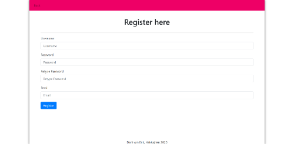

# Design

## Technical Components
Admin section to change/add parts of the Transport Network to the database;
* Using FlaskLogin and FlaskAdmin this can be achieved

Search function to search lines/stops (by name, by location);
Line/Stop lists showing all lines/stops;
Line/Stop page with info;
* Using SQLAlchemy this can be achieved by using the sqlalchemy class models.

The extra part in the models is for the types,
Stop_type refers to it being served by for example Local, Rapid, Express services

## Database
The database will be constructed using SQLAlchemy. I'll be using the train network of Hankyū Electric Railways in Ōsaka, Japan. Since I haven't found a good API to use, I'm going to construct the database myself.

## Overview

#### Navigation bar

This navigation bar can be seen on all pages *except* for the /admin urls and /register url.
The navigation bar is described in `template/layout.html`.

In the screenshot above a bar is shown for admins to go the admin page.

To the left are links to the rest of the app and to the right is a search bar and the login dropdown.

#### Login/Register

The login form can be used to login, in the when someone is logged on it'll show the logout button.

URLs linked to this are the /login and /logout URLs, they have a next_page parameter to return you to the page you came from.
Loggin in and Loggin out is regulated in `app/application.py`.

The register page can be used to register a new user, it has a back button to go back if you decide not to register.

URLs linked to this are the /register URLs, they have a next_page parameter to return you to the page you came from.
Registering is regulated in `app/application.py`.

