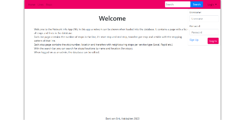
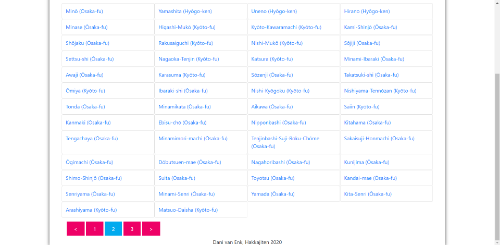
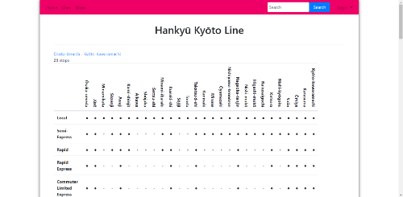
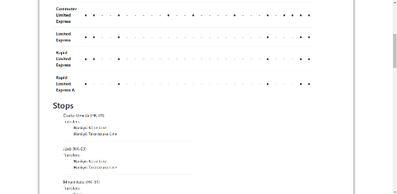
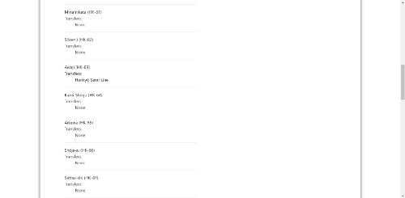
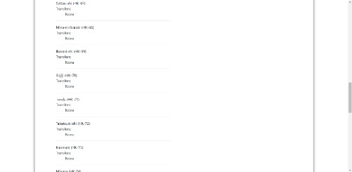
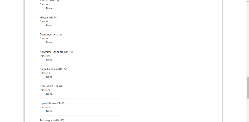
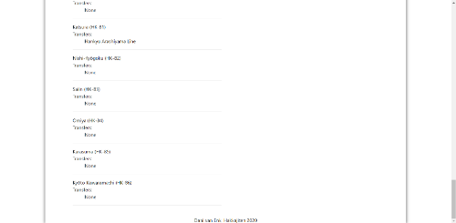
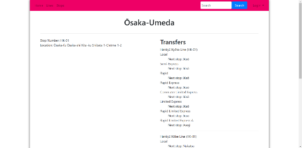
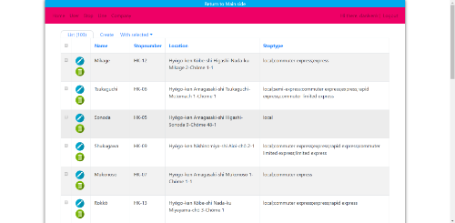

# Design

## Technical Components
Admin section to change/add parts of the Transport Network to the database;
* Using FlaskLogin and FlaskAdmin this can be achieved

Search function to search lines/stops (by name, by location);
Line/Stop lists showing all lines/stops;
Line/Stop page with info;
* Using SQLAlchemy this can be achieved by using the sqlalchemy class models.

The extra part in the models is for the types,
Stop_type refers to it being served by for example Local, Rapid, Express services

## Database
The database will be constructed using SQLAlchemy. I'll be using the train network of Hankyū Electric Railways in Ōsaka, Japan. Since I haven't found a good API to use, I'm going to construct the database myself.

## Overview

#### Navigation bar

This navigation bar can be seen on all pages *except* for the /admin urls and /register url.
The navigation bar is described in [`templates/layout.html`](templates/layout.html).

In the screenshot above a bar is shown for admins to go the admin page.

To the left are links to the rest of the app and to the right is a search bar and the login dropdown.

#### Login/Register

The login form can be used to login, in the when someone is logged on it'll show the logout button.

URLs linked to this are the /login and /logout URLs, they have a next_page parameter to return you to the page you came from.
Loggin in and Loggin out is regulated in [`app/application.py`](app/application.py) and in [`app/functions/security.py`](app/functions/security.py) are helpfunctions defined for password handling.

The register page can be used to register a new user, it has a back button to go back if you decide not to register.

URLs linked to this is the /register URL, they have a next_page parameter to return you to the page you came from.
Registering is regulated in [`app/application.py`](app/application.py) and in [`app/functions/security.py`](app/functions/security.py) are helpfunctions defined for password handling.

#### Search

The searchbar described in [`templates/layout.html`](templates/layout.html) can be used to look up Lines or Stops based on their names or Stops based on their location. Also the query can be written with or without [Macrons](https://en.wikipedia.org/wiki/Macron_(diacritic)).

URLs linked to this is the /search URL, they have a page parameter to show a page at the time with max 50 items and a query parameter which is used for the search.
The search is regulated in [`app/application.py`](app/application.py) and in [`app/functions/search.py`](app/functions/search.py) are helpfunctions defined for handling the non macron queries and showing relevant items on the top of the results.

Only 50 items per page are shown, this is described in [`templates/search.html`](templates/search.html).

#### Lines/Stops

The lines/stops lists described in [`templates/lines.html`](templates/lines.html) & [`templates/stops.html`](templates/stops.html) show a list of all the lines/stops in the database. Just like on the search page only 50 items per page are shown.

URLs linked to this are the /lines and /search URLs, they have a page parameter to show a page at the time with max 50 items.
What's shown on the page is regulated in [`app/application.py`](app/application.py).

#### Line/Stop

The line page described in [`templates/line.html`](templates/line.html) shows information about a line. It shows the end stops and the number of stops in a line. It also shows the stopping pattern and the transfers per stop.

URLs linked to this is the /line URL, it has an id parameter which refers to the Line id.
The linepage is regulated in [`app/application.py`](app/application.py) and uses the class methods of Stop and Line in the [`app/models.py`](app/models.py).

The stop page described in [`templates/stop.html`](templates/stop.html) shows information about a stop. It shows the line numbers and the Transfers. Per Transfer it shows the neighbours per stop type (Local, Rapid etc)

URLs linked to this is the /stop URL, it has an id parameter which refers to the Stop id.
The stoppage is regulated in [`app/application.py`](app/application.py) and uses the class methods of Stop and Line in the [`app/models.py`](app/models.py).

#### Admin

On the admin side of this app entries to the database can be added/edited/deleted, if you are admin of course.

URLs linked to this are all /admin URLs.

The layout of this is described in [`templates/master.html`](templates/master.html) and the rest is based on the [Flask-Admin](https://github.com/flask-admin/flask-admin) code.

#### Extras
I worked really hard on getting the connections between the Stops and Lines correct. Also the methods used with the Stops and Lines were quite some work. Getting the whole application the same style was my goal the last time I used Flask-Admin and now it finally works.

The [`script/load_data.py`](script/load_data.py) is maybe a little bit repetitive but the way it loads the data and links the rows is neat. (at least in my opinion)