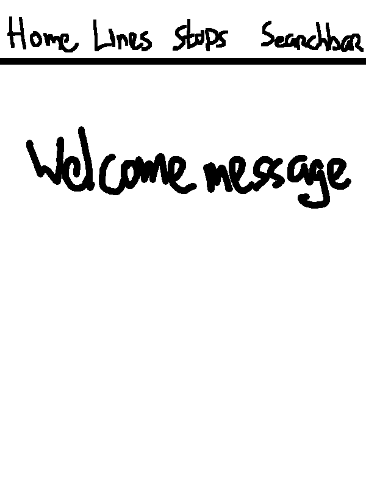
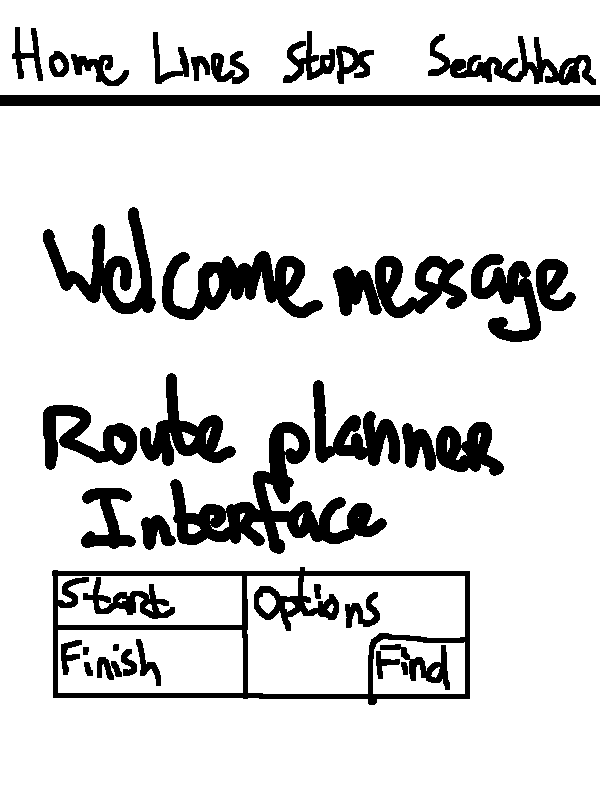
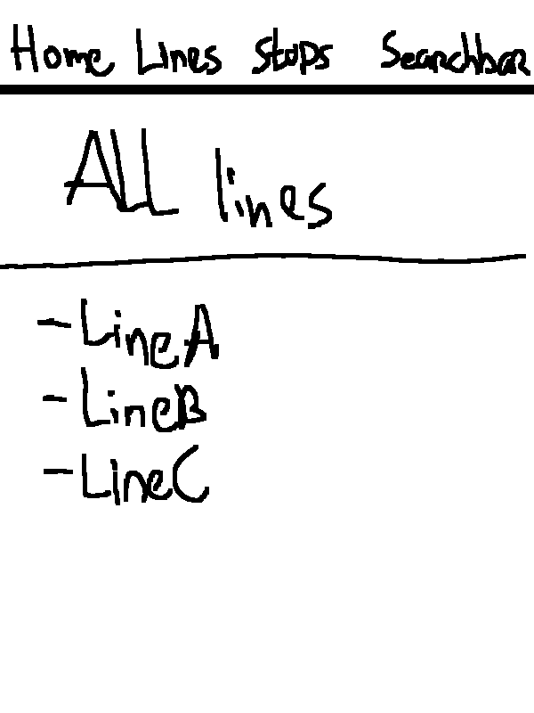
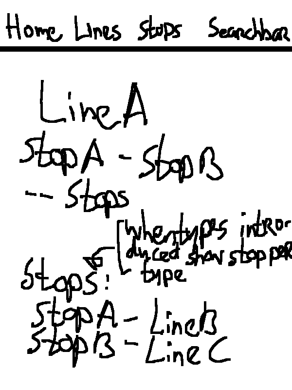
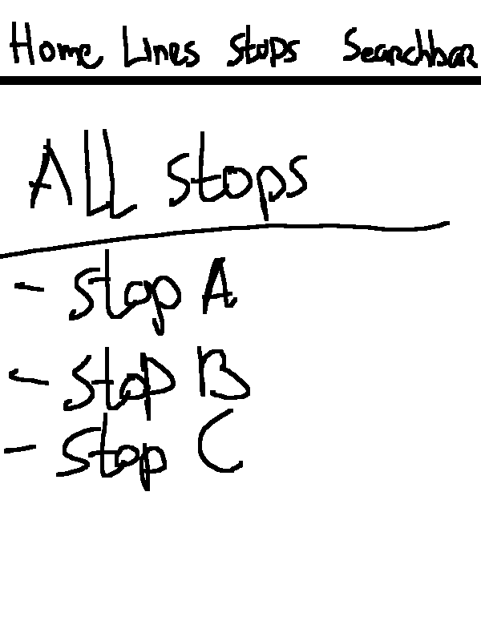
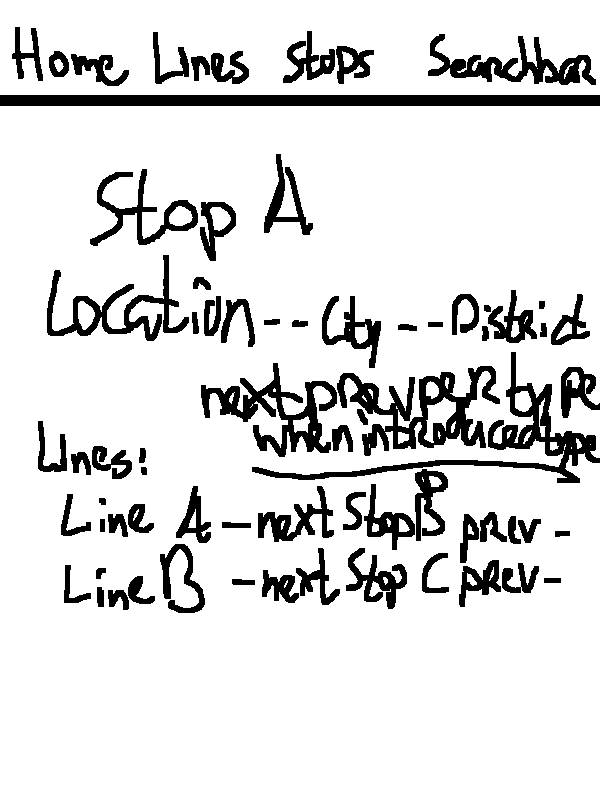
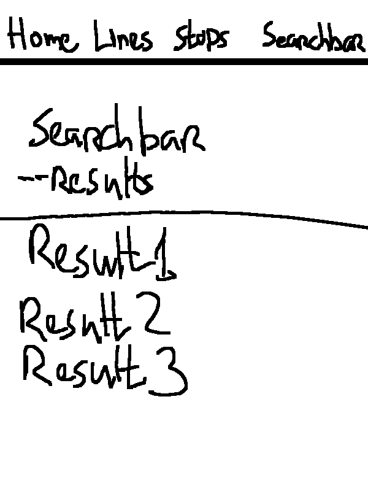
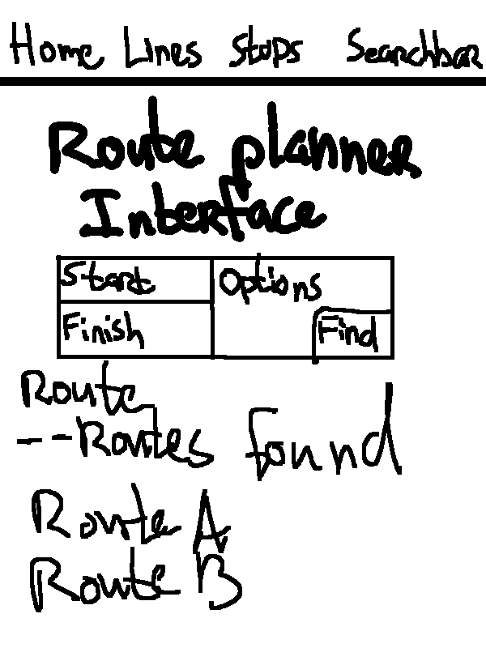
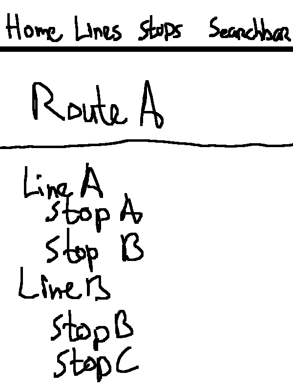

# Application Name

In this application a transport network can be set up. Once this is done separate lines can be shown with transfers at each stop. Also Separate stations can be shown with all connected lines.

Extras for this application are:
* the addition of types (like local, express, limited express which have less stops along the line)
* a route planner to plan a route from one stop to another.

***REMARK:** These extras will be implemented after the main app is completed and if they can be realized (else they'll be excluded)*

## Problem statement

Private and public transport networks all have a site where you can look up lines, transfers and plan your route along the network. People who play transport games (like City Skylines, Simutrans, Open TTD) sometimes want to visualize their network just like the networks in real life. There are tools on the internet which can help create route maps etc, for most players this is enough. But some players go as far as wanting to create a wikipedia like site about their network.

## Solution description

For those players this app can be used to do just that, in a format like real transport companies show the info about their network.

## Details and sketches

Home page shows just a welcome message

Extras Home page

Once a network has been set up:
* all lines can be shown with more info about a line on it's own page, this info includes stuff like the number of stations, a list of all stations with transfers, start and end station.

* all stops can also be shown with more info about a stop on it's own page, this info includes stuff like, the lines connected to this stop, the next/previous stop per line, location.

* a search page can be used to search for line/stops names.

Extras:
* all types of a line are shown on the line page, on a stop page the next/previous stop is shown per line and per type.
* a route planner is shown on the home page which can search routes if you give it a start and end stop.

***REMARK:** These extras will be implemented after the main app is completed and if they can be realized (else they'll be excluded)*

## Prerequisites
Datasource:
* any route map of a transport network

External Components:
* SQLAlchemy
* Bootstrap

Similar Apps (for example):
* https://www.keikyu.co.jp/ride/kakueki/
* https://railway.tobu.co.jp/guide/line/tojo_line.html
I do not know the tecniques they use but somewhere like this

Hardest part:
* Routeplanner - will do this if everything else is ok
* Types - a lot easier than the routeplanner but harder than the normal part
