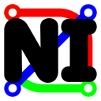

# Network Information Application

In this application a transport network can be set up. Once this is done separate lines can be shown with transfers at each stop. Also Separate stops can be shown with all connected lines. On the line page the stopping pattern of this line can be shown.

## Problem statement

Private and public transport networks all have a site where you can look up lines, transfers and plan your route along the network. People who play transport games (like City Skylines, Simutrans, Open TTD) sometimes want to visualize their network just like the networks in real life. There are tools on the internet which can help create route maps etc, for most players this is enough. But some players go as far as wanting to create a wikipedia like site about their network.

## Solution description

For those players this app can be used to do just that, in a format like real transport companies show the info about their network.

## Some screenshots

## Prerequisites
Datasource:
* The route maps of Hankyū are the data source of this app, but it is compatible with any other network in with datafiles in the same format as in /data can be found.
links to used sources:
* https://www.hankyu.co.jp/station/rosen.html (for everything else)
* https://www.openstreetmap.org/ (for locations)
* https://www.navitime.co.jp/ (for locations)
* https://ja.wikipedia.org/ (for locations and company names)

External Components:
* Bootstrap         - https://getbootstrap.com/
    used for the outlook of the app
* Flask             - https://flask.palletsprojects.com/en/1.1.x/
    used for the app setup
* Flask Admin       - https://flask-admin.readthedocs.io/en/latest/
    used for managing the database from within the app
* Flask Login       - https://flask-login.readthedocs.io/en/latest/
    used for users to login
* Flask Migrate     - https://flask-migrate.readthedocs.io/en/latest/
    used for version control of the database
* Flask Session     - https://pythonhosted.org/Flask-Session
    used for app configuration
* Flask SQLAlchemy  - https://flask-sqlalchemy.palletsprojects.com/
    used for the modeling the database

Similar Apps (for example):
* https://www.keikyu.co.jp/ride/kakueki/
* https://railway.tobu.co.jp/guide/line/tojo_line.html
I do not know the tecniques they use but somewhere like this

Hardest part:
* Getting the connections between the Stop and Line class correct. In plain python this was easy, but using relationships this can be tricky...

Dani van Enk, 2020