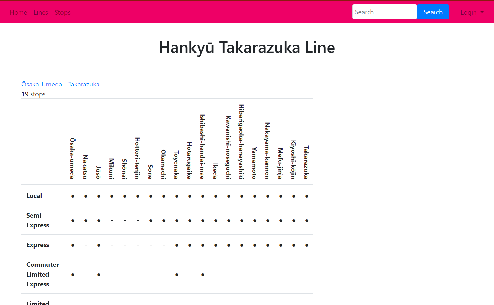
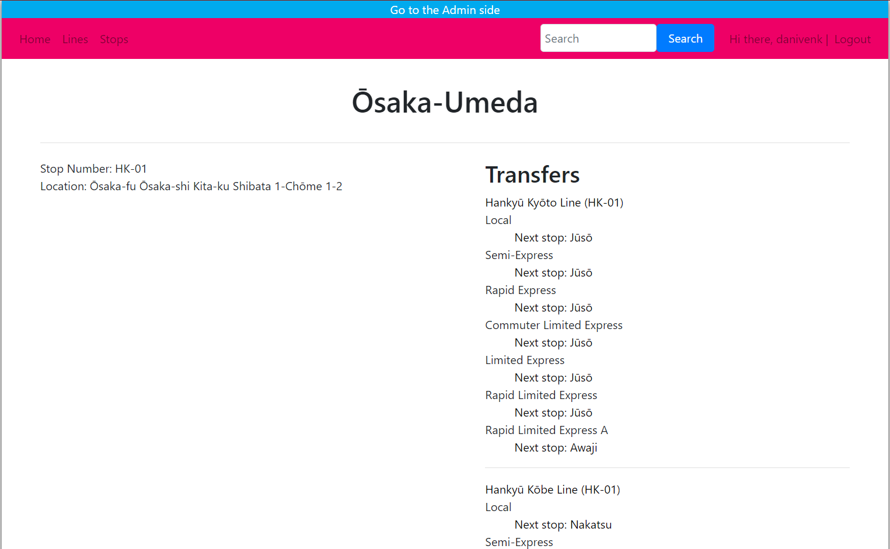

# Network Information Application

In this application a transport network can be set up. Once this is done separate lines can be shown with transfers at each stop. Also Separate stops can be shown with all connected lines. On the line page the stopping pattern of this line can be shown.

For the installation go to the [Installation Section](#installation)

## Problem statement

Private and public transport networks all have a site where you can look up lines, transfers and plan your route along the network. People who play transport games (like City Skylines, Simutrans, Open TTD) sometimes want to visualize their network just like the networks in real life. There are tools on the internet which can help create route maps etc, for most players this is enough. But some players go as far as wanting to create a wikipedia like site about their network.

## Solution description

For those players this app can be used to do just that, in a format like real transport companies show the info about their network.

## Some screenshots

## Prerequisites
Datasource:
* The route maps of Hankyū are the data source of this app, but it is compatible with any other network in with datafiles in the same format as in /data can be found.
links to used sources:
* The [Hankyū](https://www.hankyu.co.jp/station/rosen.html) website (for everything else)
* [Openstreetmap](https://www.openstreetmap.org/) (for locations)
* [Navitime](https://www.navitime.co.jp/) (for locations)
* [Wikipedia JP](https://ja.wikipedia.org/) (for locations and company names)

External Components:
* [Bootstrap](https://getbootstrap.com/)                                - used for the outlook of the app
* [Flask](https://flask.palletsprojects.com/en/1.1.x/)                  - used for the app setup
* [Flask Admin](https://flask-admin.readthedocs.io/en/latest/)          - used for managing the database from within the app
* [Flask Login](https://flask-login.readthedocs.io/en/latest/)          - used for users to login
* [Flask Migrate](https://flask-migrate.readthedocs.io/en/latest/)      - used for version control of the database
* [Flask Session](https://pythonhosted.org/Flask-Session)               - used for app configuration
* [Flask SQLAlchemy](https://flask-sqlalchemy.palletsprojects.com/)     - used for the modeling the database

Similar Apps (for example):
* [Keikū](https://www.keikyu.co.jp/ride/kakueki/)
* [Tōbu](https://railway.tobu.co.jp/guide/line/tojo_line.html)

I do not know the tecniques they use but somewhere like this

Hardest part:
* Getting the connections between the Stop and Line class correct. In plain python this was easy, but using relationships this can be tricky...

## Installation

#### Install Python
First make sure the used python version is 3.6+, the used version is 3.8

See the [Python](https://www.python.org/downloads/) website for more information.

#### Install dependencies
Next run `python -m pip install -r requirements.txt` for Linux and MacOS

Python should refer here to your version of python

For windows run `py -3 -m pip install -r requirements.txt`

-3 refers to the standard version of python3 you're running

See the [Pyhthon docs](https://docs.python.org/3/installing/index.html) for a installation guide.

**WARNING: the requirements do not modules installed with the standard version of python**

#### Create a PostgreSQL database
Create a database using something like [Heroku](https://heroku.com/)

Create an account if you don't have one already.

Next go to your dashboard and click Create New app in the "New" menu.

Choose a name and region and click create app.

Click on resources and under addons search for "Heroku Postgres".

Choose your plan (Hobby Dev is free) and click on provision.

Click on the created Heroku Postgres link.

Under settings the credentials can be found.

#### Setting Environment Variables
A couple of environment variables have to be set before the app can be run.

    FLASK_APP=app/application.py
    SECRET_KEY=some_sting
    DATABASE_URL=link_to_database

* `FLASK_APP` points to the application file to be run on `flask run`
* `SECRET_KEY` is a secret key to use for the login, this can be generated by running `python  -c "import os;print(os.urandom(1024).hex())"`.
* `DATABASE_URL` is the link to your database, the URI in the Credentials section of Heroku.

Please look up how to set them for your own system.

#### Load data
To load the data in the terminal go to the script directory and run `python load_data.py hankyu` (make sure the environment variables are set).

If you wan't to use your own data use the following names for the data files in /data:
* something_companies.csv   (columns: company,short_name,line)
* something_lines.csv       (columns: line,stop,stopnumber-prefix,stoptype,company)
* something_stops.csv       (columns: stop,line,stopnumber,location,stoptype)

something can be changed to anything you like and the command will become `python load_data.py something`

As long as you use the same style of files as in data/ the application should be able to show it correctly.
The same naming scheme and column order is important.

## Screen Cast
Literal embed didn't work so this is a thumbnail link to the youtube video

## Acknowledgements

* [Flask-Admin](https://github.com/flask-admin/flask-admin)                         - for the admin base template (in /templates/admin/)
* [Bootstrap](https://getbootstrap.com/)                                            - for the bootstrap elements (in /templates/)
* [Trash Bin](https://pixabay.com/vectors/flat-icon-material-design-1298035/)       - for the trashbin icon (in style_admin.scss)
* [Edit/Pencil](https://pixabay.com/vectors/edit-icon-pencil-icon-pencil-2375785/)  - for the edit/pencil icon (in style_admin.scss)
* CS50x University of Amsterdam/Harvard                                             - for the error handler (in /app/application.py)

Dani van Enk, 2020